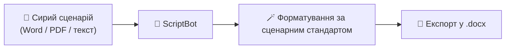

# 🤖 **ScriptToDo**
**Аналіз та підготовка сценарію до виробництва:**

---

## 🧾 **ФОРМАТУВАННЯ СЦЕНАРІЮ**

Якщо сценарій написаний не у професійній програмі, **ScriptBot**:

- 🪄 Відформатує його згідно стандартів сценарного запису  
- 💾 Збереже результат у форматі **.docx**

---

## 📊 **ТАБЛИЧНА АНАЛІТИКА СЦЕНАРІЮ**

Бот розпарсить сценарій і збереже його у вигляді таблиць з потрібною інформацією:

- 🎭 **Персонажі** — короткий опис, костюм, грим, реквізит, об’єкти тощо
  
- 🏠 **Об’єкти** — кількість епізодів, співвідношення **НАТ/ІНТ**, **ДЕНЬ/НІЧ**

### 🎭 **Приклад таблиці персонажів**

| №  | Персонаж           | Короткий опис персонажа | Роль          | № сцен            | Разом сцен | Об’єктів | День | Ніч |
|----|--------------------|-------------------------|----------------|-------------------|-------------|-----------|------|-----|
| 1  | **КОВАЛЬ**         | Молодий журналіст, головний герой | Головна роль | 1, 5, 7, 9, 11, 12, 13 | 7 | 7 | 4 | 3 |
| 2  | **СОФІЯ**          | Асистентка режисера, прагматична | Головна роль | 3, 5, 10, 15, 16 | 5 | 3 | 4 | 1 |
| 3  | **ЛАКІ**           | Пес головного героя, символ удачі | Головна роль | 14, 17, 19, 20 | 4 | 2 | 4 | 0 |
| 4  | **АЙДА**           | Художниця, подруга головного героя | Головна роль | 21, 22, 23 | 3 | 3 | 2 | 1 |

---

### 🏠 **Приклад таблиці об’єктів / сцен**

| Об’єкт1          | Об’єкт2           | Короткий зміст сцени | Персонажі | № сцен | INT | EXT | Режим | Сезон / Дата |
|------------------|-------------------|----------------------|------------|--------|-----|-----|--------|---------------|
| **HAYDEN’S MANSION** | **HAYDEN’S ROOM** | Сашко, одягнений у костюм ніндзя, стрибає на водостік | АРЧІ | 05-16 | 9:42:00 | — | День | Зима 2025 |
| **HAYDEN’S MANSION** | **BATHROOM** | Сашко відкриває вікно і починає співати | САШКО | 05-17 | — | 1:45:00 | Ніч | Зима 2025 |
| **HAYDEN’S MANSION** | **YARD** | Сашко виглядає перед залом — збирається натовп | САШКО | 05-18 | 3:15:00 | — | День | Зима 2025 |
| **HAYDEN’S MANSION** | **LIVING ROOM** | Підготовка до прикрашання ялинки | ТОВСТУН, ХУДИЙ | 05-20 | 9:06:00 | — | День | Зима 2025 |
| **SILVA GANG’S MANSION** | **KITCHEN** | Сцена вечері банди, діалог між Діаною і Бобом | ДІАНА, БОБ | 05-28 | — | 1:15:00 | Ніч | Весна 2025 |

---
---

## 🚀 **COMING SOON**

- 💥 **SFX / VFX / Трюки / Масові сцени** — повний перелік із аналітикою  
- 🚗 **Ігровий транспорт, тварини, реквізит** — підготовлений список для продакшену  
- 🎵 **Музика, картини, відеофрагменти** — структурований каталог для ліцензування  
- 📋 **Libretto** — таблиця для планування у **Google Sheets**

---

## 🧠 **AI-АНАЛІЗ СЦЕНАРІЮ**

**ScriptBot** створює рецензію на сценарій за допомогою штучного інтелекту:

- 🎬 Готує кілька логлайнів  
- 📝 Створює короткий та розширений синопсис  
- 🔍 Аналізує персонажів, діалоги, структуру та тональність  
- ⚖️ Підсвічує сильні та слабкі сторони драматургії  
- 🎥 Формує шаблон для роботи над режисерським сценарієм

---

💡 **ScriptBot** — ваш асистент, який перетворює сценарій у повноцінний робочий документ для виробництва.

